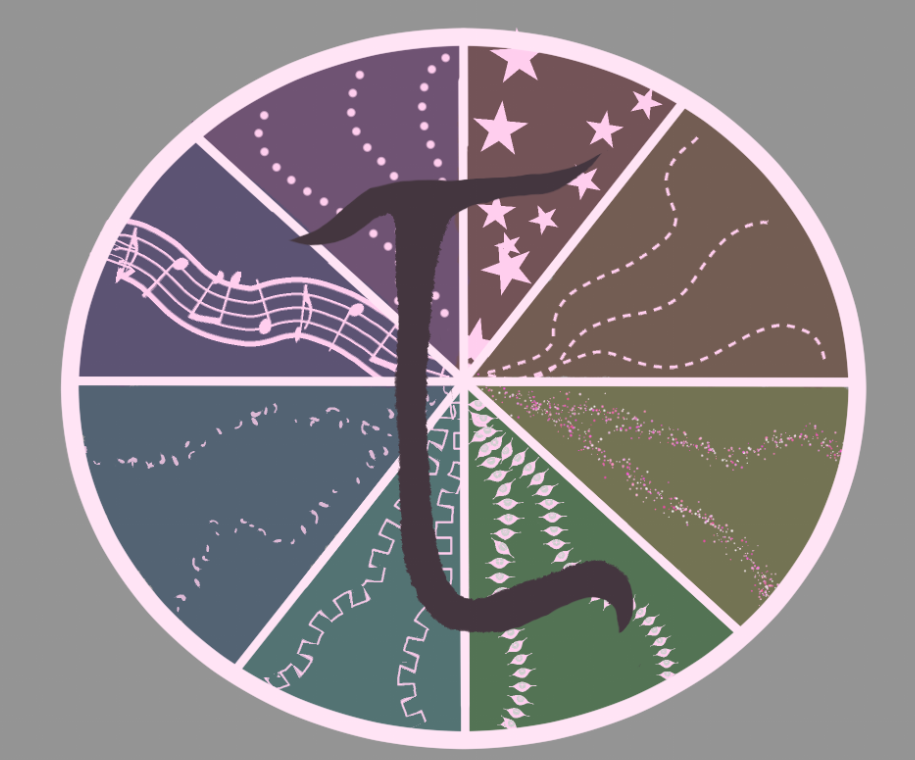
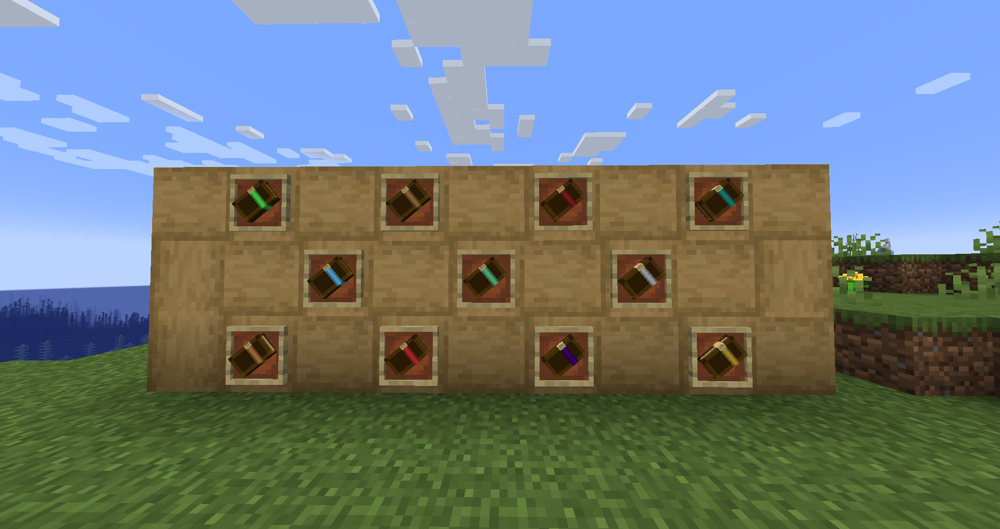
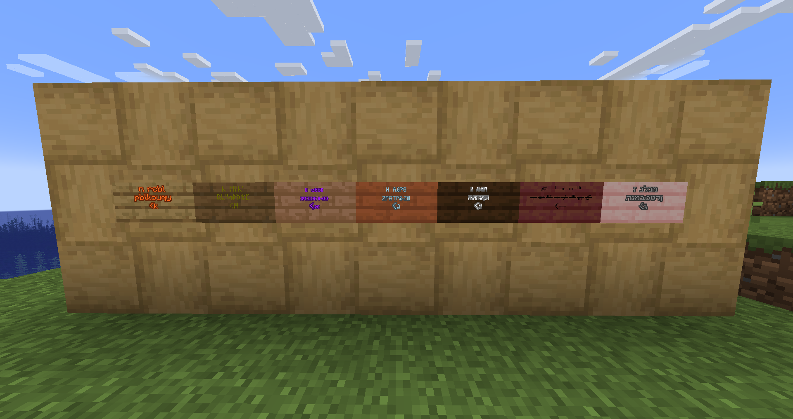

# Language System



Мод для **NeoForge 1.21.1**, добавляющий полноценную систему языков: у каждого
языка своя письменность, свой прогресс изучения и своё "звучание". Чем хуже
собеседник знает язык — тем больше его речи выглядит нечитаемыми символами (в
чате, в книгах, на табличках) или звучит неразборчиво (голос в Simple Voice
Chat). Мод самодостаточен: всё работает без дополнительных модов, Simple
Voice Chat — опциональное дополнение.

## Возможности

- **12 языков**, у каждого — своя письменность (реальный диапазон Unicode:
  руны, глаголица, чероки, брайль, огам, иврит, тифинаг, коптский, грузинский
  асомтаврули, дингбаты) и свой цвет.
- **Прогресс изучения 0–100%** хранится у игрока и растёт сам — от общения с
  носителями языка рядом и от чтения книг-самоучителей.
- **Слоговый шифр** (`RuneCipher`): текст режется на слоги, и для каждого
  прогресса детерминированно решается, узнан слог или нет — один и тот же
  слог всегда превращается в один и тот же набор символов у конкретного
  читателя, независимо от слова, в котором встретился.
- **Чат**: сообщение шифруется дважды — сначала по уровню самого ГОВОРЯЩЕГО
  (ниже 15% сказать вообще ничего не получится, 15–74% — речь "ломаная"), а
  затем ещё раз персонально под каждого ЧИТАТЕЛЯ по его собственному
  прогрессу.
- **Ванильные таблички** перехватываются через миксины: пишете на них как на
  обычных, но видимый в мире текст всегда зашифрован, а понятный вам —
  показывается в отдельном окне чтения (полноценный 3D-фон таблички).
- **Языковая бумага** (`language_book`) — можно записать текст на текущем
  языке; после подписи меняет текстуру и имя, в lore появляется язык.
- **12 книг-самоучителей**, у каждой — собственная 3D-модель с ленточкой,
  перекрашенной под цвет языка; крафтятся из тематического ингредиента, но
  только если вы уже знаете язык на 70%+.
- **Дефекты речи** — постоянная черта персонажа (картавость, сигматизм),
  искажает произношение в чате, не зависит от того, кто на каком языке
  говорит.
- **Simple Voice Chat (опционально)**: если собеседник говорит на плохо
  знакомом вам языке, его голос приглушается, а для нескольких языков ещё и
  подмешиваются тематические звуки существ (см. таблицу ниже).
- **Язык жестов** — особый случай: чтобы понять сообщение, получателя нужно
  видеть; голос по нему в Simple Voice Chat всегда полностью выключен.

## Языки

| Язык | Письменность | Звук в голосовом чате |
|---|---|---|
| Всеобщий | латиница | — (известен всем на 100%, не искажается) |
| Людской | кириллица | житель |
| Дворфийский | руны | поборник / разбойник |
| Эльфийский | глаголица | ведьма |
| Зверолюдский | чероки | смесь эмбиента обычных зверей |
| Драконий | брайль | эндер-дракон |
| Феерождённых | огам | аллай |
| Адорождённых | иврит | блэйз |
| Бездны | тифинаг | стражи, дельфины, кальмары, утопленник |
| Первородный | коптский | варден, эндермен |
| Древний | грузинский асомтаврули | нотные блоки (мелодия) |
| Язык жестов | дингбаты | — (голос выключен всегда) |

## Скриншоты

| Книги-самоучители | Зашифрованные таблички |
|---|---|
|  |  |

## Установка

1. Убедитесь, что у вас **NeoForge 1.21.1** (клиент или сервер).
2. Скачайте `langsystem-<версия>.jar` из [релизов](../../releases) и киньте в
   папку `mods`.
3. (Опционально) поставьте [Simple Voice Chat](https://modrinth.com/plugin/simple-voice-chat) —
   мод сам обнаружит его и включит приглушение голоса. Без него всё остальное
   работает как обычно.

## Использование

- **Клавиша `L`** (Options → Controls → Language System) — окно выбора
  текущего языка (того, на котором вы говорите/пишете) из известных вам.
- **`/language give <игрок> <язык> [процент]`** — выдать/повысить знание
  языка (оператор). Без процента — сразу 100%.
- **`/language take <игрок> <язык>`** — забыть язык. Всеобщий забрать нельзя.
- **`/language list <игрок>`** — все известные языки игрока с процентами.
- **`/language defect give|take|list <игрок> [дефект]`** — управление
  дефектами речи.
- **`/langvoicedebug`** — включает отладочные сообщения в чат о работе
  голосового фильтра (для проверки, что Simple Voice Chat вообще
  перехватывается).

Прогресс также растёт пассивно: раз в 30 секунд есть шанс +1% к языку, на
котором рядом бегло (75%+) говорит другой игрок, и +1% за использование
книги-самоучителя (не чаще раза в 5 игровых минут).

## Сборка из исходников

Нужен **JDK 21**.

```bash
git clone https://github.com/Makarexe/langsystem-mod.git
cd langsystem-mod
./gradlew build
```

Готовый `.jar` появится в `build/libs/`. Для быстрой проверки без сборки
полноценного jar — таск `runClient` (запускает тестовый клиент с модом).

## Структура проекта

```
src/main/java/com/langsystem/
  LangSystemMod.java              — точка входа
  Language.java                   — 12 языков, их письменность и цвет
  util/RuneCipher.java            — слоговый шифр
  util/SpeechFluency.java         — пороги "не может / ломано / бегло"
  data/                           — прогресс игрока, дефекты речи, вложения
  command/LanguageCommand.java    — /language ...
  network/                        — пакеты клиент↔сервер
  event/
    ChatLanguageHandler.java      — перехват и шифрование чата
    PassiveLearningHandler.java   — пассивный рост прогресса
    TomeCraftingHandler.java      — проверка знания при крафте самоучителя
  item/                           — книги-самоучители, языковая бумага
  block/                          — (перехват идёт через миксины на ванильные таблички)
  mixin/
    LocalPlayerMixin.java         — открытие своих экранов вместо ванильных
    SignRendererMixin.java        — зашифрованный рендер текста таблички
    SignBlockMixin.java           — не блокировать чтение другими игроками
  client/                         — GUI (выбор языка, экраны книги/таблички)
  voicechat/
    LangSystemVoicechatPlugin.java — интеграция с Simple Voice Chat

src/main/resources/
  data/langsystem/recipe/*.json           — рецепты книг-самоучителей
  data/langsystem/advancement/recipes/*.json
  assets/langsystem/models/item/*_tome.json — 3D-модели самоучителей
  assets/langsystem/textures/item/          — текстуры (общие + ленточка на язык)
```

## Лицензия

MIT — см. [LICENSE](LICENSE).
